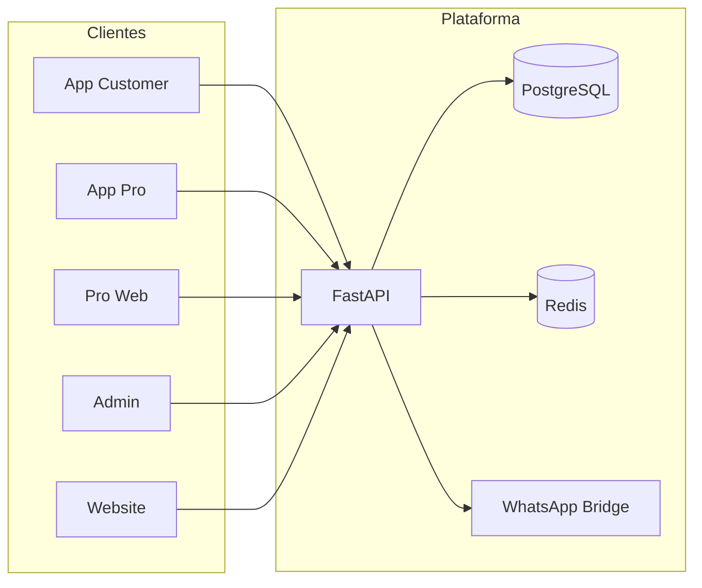

# DUNNAA — Blueprint (projeto Navaro)

> Documento-mestre do codebase em `/root/projetos/navaro`.  
> Código legado **Navaro** → produto **DUNNAA** (`dunnaa.com.br`).  
> Última análise: Junho 2026

---

## 1. Situação atual

| Item | Valor |
|------|-------|
| **Pasta servidor** | `/root/projetos/navaro` |
| **Repo Git** | `viniciussvasques/navaro` (renomear/migrar → `innexardev/Dunnaa`) |
| **Marca alvo** | **DUNNAA** / **DUNNAA Pro** |
| **Domínios produção** | `api`, `admin`, `pro`, `dunnaa.com.br` |
| **Stack deploy** | Docker Compose + Traefik (`fixelo_fixelo-network`) |
| **Status runtime** | Parado (deploy `/opt/Dunnaa` removido em jun/2026) |

Este projeto é **mais completo** que o monorepo `innexardev/Dunnaa` em apps e integrações, porém acumula **dívida de rename** (`navaro` em Redis, paths, docs) e **falta tooling** (`.cursor`, CI maduro, `packages/shared`).

---

## 2. Visão e produto

Plataforma de agendamento, fila virtual, assinaturas, produtos e pagamentos para **beleza e grooming** no Brasil.

| Produto | Pacote | Domínio / canal |
|---------|--------|-----------------|
| **DUNNAA** (cliente) | `packages/app-customer` | App Expo |
| **DUNNAA Pro** (mobile) | `packages/app-pro` | App Expo |
| **DUNNAA Pro Web** | `packages/dunnaa-pro-web` | `pro.dunnaa.com.br` |
| **Admin** | `packages/web-admin` | `admin.dunnaa.com.br` |
| **Site** | `packages/website` | `dunnaa.com.br` |
| **API** | `packages/api` | `api.dunnaa.com.br` |
| **WhatsApp Bridge** | `packages/whatsapp-bridge` | interno `:3100` |

### Proposta de valor

1. **Cliente:** buscar, agendar, fila, assinar, check-in QR, pagar (Stripe/MP)
2. **Estabelecimento:** agenda, equipe, planos, fila, produtos, comissões, WhatsApp
3. **Plataforma:** SaaS + comissão (8% avulso / 6% assinatura)

---

## 3. Arquitetura do monorepo (real)

```
navaro/                          # renomear pasta → dunnaa (opcional)
├── packages/
│   ├── api/                     # FastAPI — backend principal ✅
│   ├── app-customer/            # Expo — app cliente 🔄
│   ├── app-pro/                 # Expo — DUNNAA Pro 🔄
│   ├── dunnaa-pro-web/          # Next.js — Pro Web ✅
│   ├── web-admin/               # Next.js — Admin ✅
│   ├── website/                 # Next.js — landing ✅
│   └── whatsapp-bridge/       # Node — Baileys/API WhatsApp ✅
├── docs/                        # Documentação extensa ✅
├── logos-icons/                 # Brand assets
├── docker-compose.yml           # Stack completa produção/dev
├── package.json                 # Scripts turbo/pnpm
└── .cursor/                     # Rules/agents (adicionado jun/2026)
```

> **Nota:** README raiz ainda cita `apps/cliente` — **desatualizado**. Apps vivem em `packages/`.

### Serviços Docker Compose

| Serviço | Container | Função |
|---------|-----------|--------|
| `db` | `dunnaa-db` | PostgreSQL 16 |
| `redis` | `dunnaa-redis` | OTP, cache, filas |
| `whatsapp-bridge` | `dunnaa-whatsapp-bridge` | Mensagens WhatsApp |
| `api` | `dunnaa-api` | FastAPI :8000 |
| `admin` | build `web-admin` | Admin Next.js |
| `pro` | build `dunnaa-pro-web` | Pro Web |
| `website` | build `website` | Site público |

---

## 4. Backend API — inventário

### Rotas (`packages/api/app/api/v1/`)

| Módulo | Área |
|--------|------|
| `auth`, `profile`, `users` | Autenticação e perfil |
| `establishments`, `services`, `staff`, `staff_goals` | Estabelecimento |
| `appointments`, `queue`, `checkins`, `qr_codes` | Agenda e fila |
| `subscriptions`, `bundles`, `products` | Planos e retail |
| `payments`, `payouts`, `tips` | Financeiro |
| `reviews`, `favorites`, `portfolio` | Social / conteúdo |
| `notifications`, `analytics` | Engajamento |
| `admin_*` | Painel interno (8 módulos) |
| `support` | Suporte |

### Services (`packages/api/app/services/`)

`auth`, `appointment`, `queue`, `checkin`, `payment` (+ providers), `payout`, `wallet`, `whatsapp`, `sms`, `email`, `push`, `notification`, `analytics`, `settings`, `storage`, `support`, etc.

### Integrações

| Integração | Status |
|------------|--------|
| PostgreSQL + Alembic | ✅ |
| Redis (OTP) | ✅ (prefixo `navaro:` — **renomear**) |
| Stripe | ✅ |
| Mercado Pago | ✅ (ver `docs/MERCADOPAGO_SETUP.md`) |
| WhatsApp Bridge | ✅ (único vs repo innexardev) |
| SMS / nVoIP | ✅ (`nvoip.apib` no repo) |
| Twilio | doc em `docs/TWILIO_SETUP.md` |
| S3/R2 storage | ✅ service |

---

## 5. O que falta / gaps prioritários

### 🔴 Crítico (antes de produção)

| Gap | Detalhe |
|-----|---------|
| **Rename Navaro → DUNNAA** | Redis keys `navaro:`, strings, logs, testes |
| **Secret no Git remote** | Token embutido em `origin` — revogar e usar SSH |
| **Subir stack** | `docker compose up -d --build` em `/root/projetos/navaro` |
| **`.env` produção** | Stripe, MP, JWT, SMS — nunca commitar |
| **CI verde** | Validar `pytest` + lint no repo atual |

### 🟡 Importante (qualidade)

| Gap | Detalhe | Repo innexardev tem? |
|-----|---------|----------------------|
| **`packages/shared`** | Tipos TS compartilhados | ✅ |
| **Cobertura testes 70%+** | CI hardened | ✅ (~180 testes) |
| **Staff link endpoint** | Vincular user ↔ staff | ✅ MVP 1.1 |
| **Categorias expandidas** | nail_salon, aesthetics… | ✅ migration |
| **Deploy GitHub Actions** | SSH + Traefik | ✅ (desativar se usar só Navaro) |
| **Mercado Pago real** | SDK vs mock | verificar ambos |
| **Gorjetas Stripe** | TipService completo | comparar `tips.py` |

### 🟢 Apps frontend

| App | Gap |
|-----|-----|
| `app-customer` | Completar fluxos MVP (ver `docs/APP_CLIENTE_PLANO.md`) |
| `app-pro` | Scaffold / poucas telas |
| `dunnaa-pro-web` | Revisão em `docs/PRO_WEB_REVIEW.md` |
| `web-admin` | Gaps admin em `docs/ADMIN_BACKEND_GAPS.md` |
| `website` | Landing + SEO |

### 📄 Documentação existente (aproveitar)

| Doc | Conteúdo |
|-----|----------|
| `FEATURES.md` | Matriz de features |
| `IMPLEMENTATION_PLAN.md` | Cronograma |
| `ARCHITECTURE.md` | Decisões técnicas |
| `API.md` / `DATABASE.md` | Referência |
| `BACKEND_REVIEW.md` | Dívida técnica |
| `DUNNAA_PRO_PLAN.md` | Roadmap Pro |
| `APP_CLIENTE_PLANO.md` | Plano app cliente |

---

## 6. Plano de rename e consolidação

### Fase A — Higiene (1–2 dias)

1. Revogar token GitHub no remote; configurar `git@github.com:innexardev/Dunnaa.git`
2. Buscar/substituir `navaro` → `dunnaa` (Redis prefix, env vars, logs)
3. Atualizar README raiz com estrutura `packages/*` real
4. Adicionar `.cursor/` + `AGENTS.md` + este blueprint

### Fase B — Merge seletivo do repo innexardev (3–5 dias)

Trazer **sem reescrever** o Navaro:

- Testes e fixes de CI do `innexardev/Dunnaa`
- Features MVP 1.1 faltantes (staff link, categorias, tip webhook)
- `packages/shared` se frontends precisarem de tipos unificados

**Não** substituir: WhatsApp bridge, website, pro-web, wallet, support.

### Fase C — Produção (2–3 dias)

1. `cd /root/projetos/navaro && docker compose up -d --build`
2. `alembic upgrade head`
3. Validar domínios Traefik
4. Smoke: auth SMS, agenda, fila, admin login

---

## 7. Modelo de negócio (resumo)

| Fonte | Detalhe |
|-------|---------|
| SaaS | R$ 29 / R$ 49 mensal |
| Comissão avulso | 8% |
| Comissão assinatura | 6% |
| Gorjetas | 100% profissional |

---

## 8. Stack técnica

| Camada | Tecnologia |
|--------|------------|
| API | FastAPI, SQLAlchemy 2 async, Pydantic v2 |
| DB | PostgreSQL 16 |
| Cache | Redis 7 |
| Mobile | Expo / React Native |
| Web | Next.js (admin, pro, site) |
| Pagamentos | Stripe + Mercado Pago |
| Mensagens | WhatsApp Bridge + SMS |
| Infra | Docker, Traefik, Cloudflare |

---

## 9. Diagrama de domínios



---

## 10. Critérios de aceite (retomada produção)

- [ ] Stack Navaro sobe com `docker compose up`
- [ ] `GET /health` → 200 em `api.dunnaa.com.br`
- [ ] Admin, Pro Web e Site respondem nos domínios
- [ ] Login SMS / OTP funcional
- [ ] Zero referências críticas a `navaro` em runtime
- [ ] CI pytest + ruff verde
- [ ] Secrets fora do Git

---

## 11. Decisão estratégica

**Foco:** melhorar e operar **este** codebase (Navaro/DUNNAA completo), não o deploy mínimo em `/opt/Dunnaa`.

**Próximo passo imediato:** subir stack + executar Fase A do rename.

---

*DUNNAA — agendamento, beleza e produtos. Codebase Navaro → produto único.*
