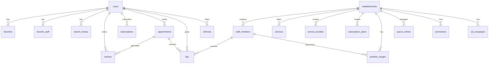

# 🗄️ Navaro - Modelo de Dados Completo

## Diagrama ER Simplificado



---

## Tabelas Core

### users
```sql
CREATE TABLE users (
    id UUID PRIMARY KEY DEFAULT gen_random_uuid(),
    phone VARCHAR(20) UNIQUE NOT NULL,
    name VARCHAR(200),
    email VARCHAR(255),
    avatar_url TEXT,
    role VARCHAR(20) DEFAULT 'customer', -- customer, owner, admin
    referral_code VARCHAR(20) UNIQUE,
    referred_by_id UUID REFERENCES users(id),
    created_at TIMESTAMPTZ DEFAULT NOW(),
    updated_at TIMESTAMPTZ DEFAULT NOW()
);
```

### establishments
```sql
CREATE TABLE establishments (
    id UUID PRIMARY KEY DEFAULT gen_random_uuid(),
    owner_id UUID NOT NULL REFERENCES users(id),
    name VARCHAR(200) NOT NULL,
    slug VARCHAR(100) UNIQUE NOT NULL,
    category VARCHAR(20) NOT NULL, -- barbershop, salon
    
    -- Endereço
    address TEXT NOT NULL,
    city VARCHAR(100) NOT NULL,
    state VARCHAR(2) NOT NULL,
    latitude DECIMAL(10, 8),
    longitude DECIMAL(11, 8),
    
    -- Contato
    phone VARCHAR(20) NOT NULL,
    whatsapp VARCHAR(20),
    
    -- Visual
    logo_url TEXT,
    cover_url TEXT,
    
    -- Google
    google_place_id VARCHAR(255),
    google_maps_url TEXT,
    
    -- Config
    business_hours JSONB DEFAULT '{}',
    queue_mode_enabled BOOLEAN DEFAULT FALSE,
    
    -- Status
    status VARCHAR(20) DEFAULT 'pending', -- pending, active, suspended
    subscription_status VARCHAR(20) DEFAULT 'trial', -- trial, active, cancelled
    subscription_expires_at TIMESTAMPTZ,
    
    -- Stripe
    stripe_account_id VARCHAR(255),
    
    created_at TIMESTAMPTZ DEFAULT NOW(),
    updated_at TIMESTAMPTZ DEFAULT NOW()
);

CREATE INDEX idx_establishments_city ON establishments(city);
CREATE INDEX idx_establishments_location ON establishments(latitude, longitude);
```

### staff_members
```sql
CREATE TABLE staff_members (
    id UUID PRIMARY KEY DEFAULT gen_random_uuid(),
    establishment_id UUID NOT NULL REFERENCES establishments(id),
    name VARCHAR(200) NOT NULL,
    phone VARCHAR(20),
    role VARCHAR(100), -- barbeiro, cabeleireiro
    avatar_url TEXT,
    work_schedule JSONB DEFAULT '{}',
    commission_rate DECIMAL(5, 2),
    active BOOLEAN DEFAULT TRUE,
    created_at TIMESTAMPTZ DEFAULT NOW()
);
```

### services
```sql
CREATE TABLE services (
    id UUID PRIMARY KEY DEFAULT gen_random_uuid(),
    establishment_id UUID NOT NULL REFERENCES establishments(id),
    name VARCHAR(200) NOT NULL,
    description TEXT,
    price DECIMAL(10, 2) NOT NULL,
    duration_minutes INT NOT NULL DEFAULT 30,
    active BOOLEAN DEFAULT TRUE,
    sort_order INT DEFAULT 0,
    created_at TIMESTAMPTZ DEFAULT NOW()
);

CREATE TABLE service_staff (
    id UUID PRIMARY KEY DEFAULT gen_random_uuid(),
    service_id UUID NOT NULL REFERENCES services(id),
    staff_id UUID NOT NULL REFERENCES staff_members(id),
    UNIQUE(service_id, staff_id)
);
```

---

## Tabelas de Pacotes e Combos

### service_bundles
```sql
CREATE TABLE service_bundles (
    id UUID PRIMARY KEY DEFAULT gen_random_uuid(),
    establishment_id UUID NOT NULL REFERENCES establishments(id),
    name VARCHAR(200) NOT NULL,
    description TEXT,
    original_price DECIMAL(10, 2) NOT NULL, -- soma dos serviços
    bundle_price DECIMAL(10, 2) NOT NULL, -- preço com desconto
    discount_percent DECIMAL(5, 2),
    active BOOLEAN DEFAULT TRUE,
    created_at TIMESTAMPTZ DEFAULT NOW()
);

CREATE TABLE service_bundle_items (
    id UUID PRIMARY KEY DEFAULT gen_random_uuid(),
    bundle_id UUID NOT NULL REFERENCES service_bundles(id),
    service_id UUID NOT NULL REFERENCES services(id)
);
```

---

## Tabelas de Assinatura

### subscription_plans
```sql
CREATE TABLE subscription_plans (
    id UUID PRIMARY KEY DEFAULT gen_random_uuid(),
    establishment_id UUID NOT NULL REFERENCES establishments(id),
    name VARCHAR(100) NOT NULL,
    description TEXT,
    price DECIMAL(10, 2) NOT NULL,
    active BOOLEAN DEFAULT TRUE,
    stripe_price_id VARCHAR(255),
    created_at TIMESTAMPTZ DEFAULT NOW()
);

-- Itens incluídos no plano
CREATE TABLE subscription_plan_items (
    id UUID PRIMARY KEY DEFAULT gen_random_uuid(),
    plan_id UUID NOT NULL REFERENCES subscription_plans(id),
    service_id UUID REFERENCES services(id),
    bundle_id UUID REFERENCES service_bundles(id),
    quantity_per_month INT NOT NULL DEFAULT 4, -- ex: 4 cortes/mês
    CONSTRAINT chk_item CHECK (service_id IS NOT NULL OR bundle_id IS NOT NULL)
);

CREATE TABLE subscriptions (
    id UUID PRIMARY KEY DEFAULT gen_random_uuid(),
    user_id UUID NOT NULL REFERENCES users(id),
    plan_id UUID NOT NULL REFERENCES subscription_plans(id),
    establishment_id UUID NOT NULL REFERENCES establishments(id),
    status VARCHAR(20) DEFAULT 'active', -- active, cancelled, expired
    current_period_start TIMESTAMPTZ NOT NULL,
    current_period_end TIMESTAMPTZ NOT NULL,
    stripe_subscription_id VARCHAR(255),
    created_at TIMESTAMPTZ DEFAULT NOW(),
    cancelled_at TIMESTAMPTZ
);

CREATE TABLE subscription_usage (
    id UUID PRIMARY KEY DEFAULT gen_random_uuid(),
    subscription_id UUID NOT NULL REFERENCES subscriptions(id),
    plan_item_id UUID NOT NULL REFERENCES subscription_plan_items(id),
    month_start DATE NOT NULL,
    uses_this_month INT DEFAULT 0,
    last_use_date DATE,
    UNIQUE(subscription_id, plan_item_id, month_start)
);
```

---

## Tabelas de Agendamento

### appointments
```sql
CREATE TABLE appointments (
    id UUID PRIMARY KEY DEFAULT gen_random_uuid(),
    user_id UUID NOT NULL REFERENCES users(id),
    establishment_id UUID NOT NULL REFERENCES establishments(id),
    service_id UUID REFERENCES services(id),
    bundle_id UUID REFERENCES service_bundles(id),
    staff_id UUID NOT NULL REFERENCES staff_members(id),
    subscription_id UUID REFERENCES subscriptions(id),
    
    scheduled_at TIMESTAMPTZ NOT NULL,
    duration_minutes INT NOT NULL,
    
    status VARCHAR(20) DEFAULT 'pending', -- pending, confirmed, completed, cancelled, no_show
    payment_type VARCHAR(20) NOT NULL, -- single, subscription
    
    created_at TIMESTAMPTZ DEFAULT NOW()
);

CREATE INDEX idx_appointments_scheduled ON appointments(scheduled_at);
CREATE INDEX idx_appointments_staff ON appointments(staff_id, scheduled_at);
```

### checkins
```sql
CREATE TABLE checkins (
    id UUID PRIMARY KEY DEFAULT gen_random_uuid(),
    appointment_id UUID UNIQUE NOT NULL REFERENCES appointments(id),
    user_id UUID NOT NULL REFERENCES users(id),
    establishment_id UUID NOT NULL REFERENCES establishments(id),
    checked_in_at TIMESTAMPTZ DEFAULT NOW(),
    subscription_use_consumed BOOLEAN DEFAULT FALSE
);
```

---

## Tabelas de Fila

### queue_entries
```sql
CREATE TABLE queue_entries (
    id UUID PRIMARY KEY DEFAULT gen_random_uuid(),
    establishment_id UUID NOT NULL REFERENCES establishments(id),
    user_id UUID NOT NULL REFERENCES users(id),
    service_id UUID REFERENCES services(id),
    staff_id UUID REFERENCES staff_members(id), -- preferência
    
    position INT NOT NULL,
    status VARCHAR(20) DEFAULT 'waiting', -- waiting, called, serving, completed, left
    
    entered_at TIMESTAMPTZ DEFAULT NOW(),
    called_at TIMESTAMPTZ,
    completed_at TIMESTAMPTZ
);

CREATE INDEX idx_queue_establishment ON queue_entries(establishment_id, status);
```

---

## Tabelas de Favoritos

### favorites
```sql
CREATE TABLE favorites (
    id UUID PRIMARY KEY DEFAULT gen_random_uuid(),
    user_id UUID NOT NULL REFERENCES users(id),
    establishment_id UUID NOT NULL REFERENCES establishments(id),
    created_at TIMESTAMPTZ DEFAULT NOW(),
    UNIQUE(user_id, establishment_id)
);

CREATE TABLE favorite_staff (
    id UUID PRIMARY KEY DEFAULT gen_random_uuid(),
    user_id UUID NOT NULL REFERENCES users(id),
    staff_id UUID NOT NULL REFERENCES staff_members(id),
    establishment_id UUID NOT NULL REFERENCES establishments(id),
    created_at TIMESTAMPTZ DEFAULT NOW(),
    UNIQUE(user_id, staff_id)
);
```

---

## Tabelas de Avaliação

### reviews
```sql
CREATE TABLE reviews (
    id UUID PRIMARY KEY DEFAULT gen_random_uuid(),
    user_id UUID NOT NULL REFERENCES users(id),
    establishment_id UUID NOT NULL REFERENCES establishments(id),
    staff_id UUID REFERENCES staff_members(id),
    appointment_id UUID REFERENCES appointments(id),
    
    rating INT NOT NULL CHECK (rating >= 1 AND rating <= 5),
    comment TEXT,
    
    -- Resposta da barbearia
    owner_response TEXT,
    owner_responded_at TIMESTAMPTZ,
    
    -- Integração Google
    approved_for_google BOOLEAN DEFAULT FALSE,
    sent_to_google BOOLEAN DEFAULT FALSE,
    google_review_id VARCHAR(255),
    sent_to_google_at TIMESTAMPTZ,
    
    created_at TIMESTAMPTZ DEFAULT NOW()
);
```

---

## Tabelas de Gorjeta

### tips
```sql
CREATE TABLE tips (
    id UUID PRIMARY KEY DEFAULT gen_random_uuid(),
    user_id UUID NOT NULL REFERENCES users(id),
    staff_id UUID NOT NULL REFERENCES staff_members(id),
    establishment_id UUID NOT NULL REFERENCES establishments(id),
    appointment_id UUID REFERENCES appointments(id),
    
    amount DECIMAL(10, 2) NOT NULL,
    stripe_payment_id VARCHAR(255),
    status VARCHAR(20) DEFAULT 'pending', -- pending, succeeded, failed
    
    created_at TIMESTAMPTZ DEFAULT NOW()
);
```

---

## Tabelas de Pagamento

### payments
```sql
CREATE TABLE payments (
    id UUID PRIMARY KEY DEFAULT gen_random_uuid(),
    user_id UUID NOT NULL REFERENCES users(id),
    establishment_id UUID NOT NULL REFERENCES establishments(id),
    appointment_id UUID REFERENCES appointments(id),
    subscription_id UUID REFERENCES subscriptions(id),
    
    type VARCHAR(30) NOT NULL, -- single, subscription, subscription_renewal
    amount DECIMAL(10, 2) NOT NULL,
    platform_fee DECIMAL(10, 2) NOT NULL, -- 5% do valor
    gateway_fee DECIMAL(10, 2) NOT NULL,
    net_amount DECIMAL(10, 2) NOT NULL,
    
    stripe_payment_id VARCHAR(255),
    status VARCHAR(20) DEFAULT 'pending',
    
    created_at TIMESTAMPTZ DEFAULT NOW()
);

CREATE TABLE payouts (
    id UUID PRIMARY KEY DEFAULT gen_random_uuid(),
    establishment_id UUID NOT NULL REFERENCES establishments(id),
    amount DECIMAL(10, 2) NOT NULL,
    stripe_payout_id VARCHAR(255),
    status VARCHAR(20) DEFAULT 'pending',
    created_at TIMESTAMPTZ DEFAULT NOW(),
    paid_at TIMESTAMPTZ
);
```

---

## Tabelas de Portfólio

### portfolio_images
```sql
CREATE TABLE portfolio_images (
    id UUID PRIMARY KEY DEFAULT gen_random_uuid(),
    establishment_id UUID NOT NULL REFERENCES establishments(id),
    staff_id UUID REFERENCES staff_members(id),
    image_url TEXT NOT NULL,
    description TEXT,
    created_at TIMESTAMPTZ DEFAULT NOW()
);
```

---

## Tabelas de Histórico e Busca

### search_history
```sql
CREATE TABLE search_history (
    id UUID PRIMARY KEY DEFAULT gen_random_uuid(),
    user_id UUID NOT NULL REFERENCES users(id),
    query VARCHAR(255) NOT NULL,
    establishment_clicked_id UUID REFERENCES establishments(id),
    created_at TIMESTAMPTZ DEFAULT NOW()
);

CREATE INDEX idx_search_user ON search_history(user_id, created_at DESC);
```

---

## Tabelas de Referral

### referrals
```sql
CREATE TABLE referrals (
    id UUID PRIMARY KEY DEFAULT gen_random_uuid(),
    referrer_id UUID NOT NULL REFERENCES users(id),
    referred_id UUID NOT NULL REFERENCES users(id),
    reward_amount DECIMAL(10, 2),
    reward_claimed BOOLEAN DEFAULT FALSE,
    created_at TIMESTAMPTZ DEFAULT NOW()
);
```

---

## Tabelas de Promoções

### promotions
```sql
CREATE TABLE promotions (
    id UUID PRIMARY KEY DEFAULT gen_random_uuid(),
    establishment_id UUID NOT NULL REFERENCES establishments(id),
    title VARCHAR(200) NOT NULL,
    description TEXT,
    discount_type VARCHAR(20), -- percent, fixed
    discount_value DECIMAL(10, 2),
    service_id UUID REFERENCES services(id),
    bundle_id UUID REFERENCES service_bundles(id),
    start_date DATE,
    end_date DATE,
    active BOOLEAN DEFAULT TRUE,
    created_at TIMESTAMPTZ DEFAULT NOW()
);
```

---

## Tabelas de Plugins (MVP 2.0)

### establishment_plugins
```sql
CREATE TABLE establishment_plugins (
    id UUID PRIMARY KEY DEFAULT gen_random_uuid(),
    establishment_id UUID NOT NULL REFERENCES establishments(id),
    plugin_type VARCHAR(50) NOT NULL, -- ads, marketing, analytics
    active BOOLEAN DEFAULT TRUE,
    config JSONB DEFAULT '{}',
    expires_at TIMESTAMPTZ,
    created_at TIMESTAMPTZ DEFAULT NOW()
);
```

### ad_campaigns
```sql
CREATE TABLE ad_campaigns (
    id UUID PRIMARY KEY DEFAULT gen_random_uuid(),
    establishment_id UUID NOT NULL REFERENCES establishments(id),
    name VARCHAR(200),
    budget_daily DECIMAL(10, 2) NOT NULL,
    spent_today DECIMAL(10, 2) DEFAULT 0,
    total_spent DECIMAL(10, 2) DEFAULT 0,
    impressions INT DEFAULT 0,
    clicks INT DEFAULT 0,
    start_date DATE NOT NULL,
    end_date DATE,
    active BOOLEAN DEFAULT TRUE,
    created_at TIMESTAMPTZ DEFAULT NOW()
);
```

---

## Índices Importantes

```sql
-- Performance de busca
CREATE INDEX idx_establishments_search ON establishments 
    USING gin(to_tsvector('portuguese', name || ' ' || city));

-- Geolocalização
CREATE INDEX idx_establishments_geo ON establishments 
    USING gist(ll_to_earth(latitude, longitude));

-- Agendamentos
CREATE INDEX idx_appointments_user_date ON appointments(user_id, scheduled_at);
CREATE INDEX idx_appointments_status ON appointments(status) WHERE status = 'pending';

-- Avaliações
CREATE INDEX idx_reviews_establishment ON reviews(establishment_id, rating);
```

---

*Última atualização: Fevereiro 2026*
